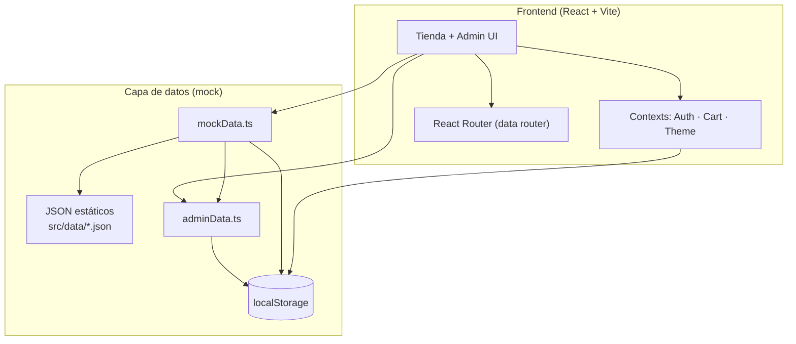

<div align="center">

<!-- Hero -->
<div style="background: linear-gradient(135deg, #1565c0 0%, #0d47a1 60%, #ff6f00 100%); border-radius: 12px; padding: 48px 32px; color: #ffffff; margin: 16px 0 32px;">
  <h1 style="color: #ffffff; font-size: 2.4em; margin: 0; font-weight: 800; letter-spacing: -0.5px;">
    Marlbtime Store
  </h1>
  <p style="color: #ffffff; opacity: 0.92; font-size: 1.15em; margin: 12px 0 24px; max-width: 640px; margin-left: auto; margin-right: auto;">
    Tu marketplace de tecnología y gaming · Encontrá lo que buscás y coordiná tu compra por mensaje
  </p>
  <p style="margin: 0;">
    <a href="https://github.com/Souto751/marlbtime" style="display: inline-block; background: #ff6f00; color: #ffffff; padding: 10px 22px; border-radius: 8px; text-decoration: none; font-weight: 600; margin: 4px;">Ver repositorio</a>
    &nbsp;
    <a href="#inicio-rápido" style="display: inline-block; background: transparent; color: #ffffff; padding: 10px 22px; border-radius: 8px; text-decoration: none; font-weight: 600; border: 2px solid #ffffff; margin: 4px;">Inicio rápido</a>
  </p>
</div>

<!-- Badges -->
<p>
  
  
  
  
  
</p>

<p style="color: #64748b; font-size: 0.95em;">
  E-commerce frontend · Sin backend · Compras por WhatsApp · Panel admin integrado
</p>

</div>

---

## Sobre el proyecto

**Marlbtime Store** es una tienda online de demostración orientada al mercado argentino. Combina catálogo de productos, carrito, publicaciones de vendedores y un **panel de administración** completo, todo en el navegador con datos mock persistidos en `localStorage`.

No hay pasarela de pagos: el checkout redirige a **WhatsApp** para coordinar la compra, envío o retiro.

<table>
<tr>
<td width="33%" valign="top" style="background: #f5f7fa; border-radius: 8px; padding: 16px;">
<strong style="color: #1565c0;">Comprá fácil</strong><br/>
Catálogo con filtros, ofertas, usados y ficha de producto detallada.
</td>
<td width="33%" valign="top" style="background: #f5f7fa; border-radius: 8px; padding: 16px;">
<strong style="color: #1565c0;">Vendedores</strong><br/>
Registro, login y publicación de productos propios desde la tienda.
</td>
<td width="33%" valign="top" style="background: #f5f7fa; border-radius: 8px; padding: 16px;">
<strong style="color: #1565c0;">Administración</strong><br/>
Dashboard, stock, ofertas, mensajes, transacciones y proveedores.
</td>
</tr>
</table>

---

## Características principales

### Tienda pública

| Área | Detalle |
|------|---------|
| **Home** | Hero con gradiente, categorías destacadas y productos en oferta |
| **Catálogo** | Listado con filtros avanzados (precio, categoría, condición, tags) |
| **Ficha de producto** | Galería con carrusel, descripción, specs, reviews, Q&A y relacionados |
| **Carrito** | Gestión de ítems y checkout vía WhatsApp |
| **Modo claro/oscuro** | Tema persistente con paleta azul `#1565c0` y acento naranja `#ff6f00` |
| **UX** | Scroll al top en navegación nueva y restauración al volver atrás |

### Panel admin (`/admin`)

| Módulo | Función |
|--------|---------|
| **Dashboard** | KPIs, gráficos mock y resumen de actividad |
| **Productos** | Alta, edición y gestión completa del catálogo |
| **Stock** | Ajuste rápido de inventario |
| **Ofertas** | Descuentos y precios promocionales |
| **Mensajes** | Bandeja de consultas de clientes |
| **Transacciones** | Compras y ventas registradas |
| **Proveedores** | ABM de proveedores |

> Las ediciones del admin se guardan en `localStorage` y se fusionan con los datos mock del catálogo.

---

## Roles y credenciales demo

<div style="background: #ffffff; border: 1px solid rgba(21,101,192,0.2); border-left: 4px solid #1565c0; border-radius: 8px; padding: 16px 20px; margin: 8px 0;">

| Rol | Email | Contraseña | Acceso |
|-----|-------|------------|--------|
| Comprador | `demo@marlbtime.com` | `123456` | Carrito, registro, navegación |
| Vendedor | `vendedor@marlbtime.com` | `123456` | Publicar y gestionar publicaciones |
| Admin | `admin@marlbtime.com` | `123456` | Panel `/admin` completo |

</div>

---

## Arquitectura



---

## Stack tecnológico

<table>
<tr>
<td align="center" width="20%"><strong style="color:#1565c0;">UI</strong><br/>React 19 · MUI v6 · Emotion</td>
<td align="center" width="20%"><strong style="color:#1565c0;">Lenguaje</strong><br/>TypeScript 6</td>
<td align="center" width="20%"><strong style="color:#1565c0;">Build</strong><br/>Vite 8</td>
<td align="center" width="20%"><strong style="color:#1565c0;">Routing</strong><br/>React Router 7</td>
<td align="center" width="20%"><strong style="color:#1565c0;">Datos</strong><br/>JSON + localStorage</td>
</tr>
</table>

---

## Inicio rápido

### Requisitos

- Node.js 18+
- npm

### Instalación y ejecución

```bash
# Clonar el repositorio
git clone https://github.com/Souto751/marlbtime.git
cd marlbtime

# Instalar dependencias
npm install

# Servidor de desarrollo
npm run dev

# Build de producción
npm run build

# Vista previa del build
npm run preview
```

La app corre por defecto en `http://localhost:5173`.

---

## Rutas principales

| Ruta | Descripción |
|------|-------------|
| `/` | Home |
| `/productos` | Catálogo general |
| `/categoria/:slug` | Productos por categoría |
| `/producto/:id` | Detalle de producto |
| `/carrito` | Carrito de compras |
| `/login` · `/registro` | Autenticación |
| `/publicar` | Publicar producto (vendedor) |
| `/mis-publicaciones` | Publicaciones del vendedor |
| `/admin` | Panel de administración |
| `/admin/productos/:id` | Editar o crear producto (`id=nuevo`) |

---

## Estructura del proyecto

```
src/
├── App.tsx                 # Rutas (createBrowserRouter)
├── theme.ts                # Tema MUI (claro/oscuro)
├── components/             # UI reutilizable (cards, filtros, layout…)
├── contexts/               # Auth, carrito, tema, drawer
├── data/                   # JSON mock (productos, usuarios, categorías…)
├── hooks/                  # useAppNavigate y utilidades
├── pages/                  # Páginas de la tienda
│   └── admin/              # Panel de administración
├── services/
│   ├── mockData.ts         # Catálogo, usuarios, reviews
│   ├── adminData.ts        # Persistencia admin en localStorage
│   └── productFilters.ts   # Lógica de filtros
└── types/                  # Tipos TypeScript compartidos
```

---

## Paleta de diseño

Inspirada en el hero y componentes de la app:

| Token | Color | Uso |
|-------|-------|-----|
| Primary | `#1565c0` | Botones, links, acentos |
| Primary dark | `#0d47a1` | Gradientes, hover |
| Secondary | `#ff6f00` | CTAs destacados |
| Background | `#f5f7fa` | Fondo claro |
| Paper | `#ffffff` | Tarjetas y superficies |

Tipografía: **Roboto**, botones sin mayúsculas forzadas, bordes redondeados de **8px**.

---

## Contacto de la tienda (mock)

| Campo | Valor |
|-------|-------|
| Web | marlbtime.com.ar |
| Email | contacto@marlbtime.com |
| Teléfono | (011) 1234-5678 |
| Dirección | Av. Corrientes 1234, CABA, Argentina |

---

<div align="center">

<p style="color: #64748b; margin-top: 32px;">
  Hecho con la misma identidad visual de <strong style="color: #1565c0;">Marlbtime Store</strong>
</p>

<p>
  
  
  
</p>

</div>
